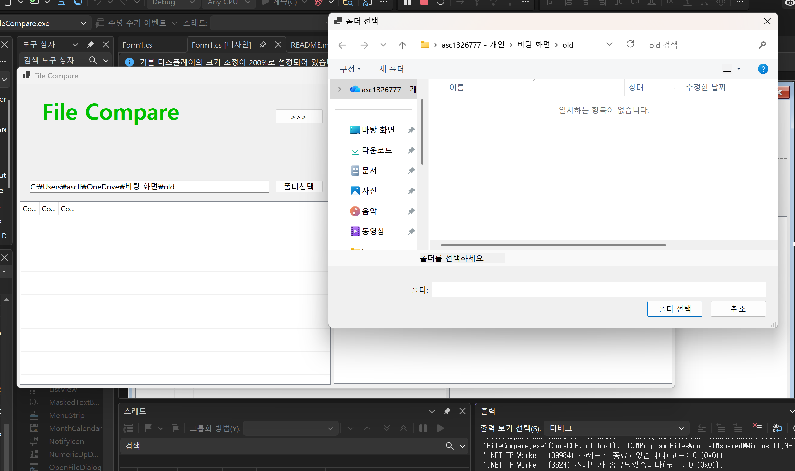
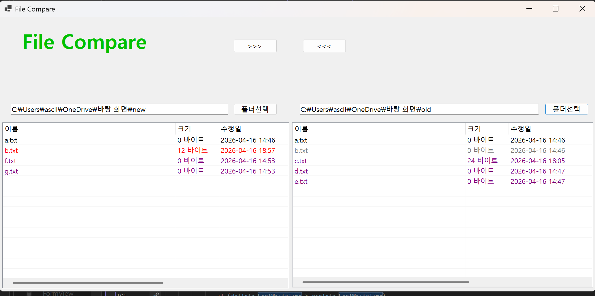
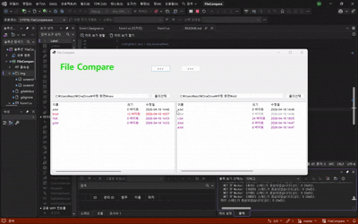
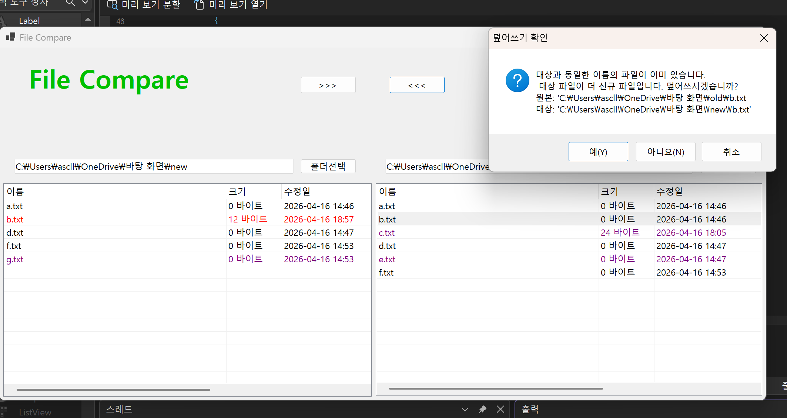
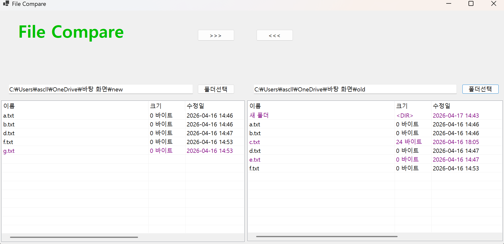

# (C# 코딩) 
## 개요
- C# 프로그래밍 학습
- 1줄 소개: 사용자가 선택한 파일을 비교/복사하는 프로그램
- 사용한 플랫폼:
- C#, .NET Windows Forms, Visual Studio, GitHub
- 사용한 컨트롤:
- Label, TextBox, Button, SplitContainer, ListView, Panel
- 사용한 기술과 구현한 기능:
- 폴더 선택 버튼을 통해 선택한 폴더의 경로를 텍스트 박스에 표시
- ListView를 사용하여 폴더 내의 파일 목록을 표시
- 양쪽 폴더 내의 파일을 비교하여 차이점을 색상으로 표시
- 다른 폴더의 파일을 복사/덮어쓰기하는 기능 구현

## 실행 화면 (과제1)
- 코드의 실행 스크린샷과 구현 내용 설명

- 구현한 내용 (위 그림 참조)
- 필요한 컨트롤들을 적절하게 배치하여 기본적인 UI를 구성하였다.
- Anchor 속성을 활용하여 폼의 크기가 변경되어도 컨트롤들이 적절하게 위치하도록 설정하였다.
- 오른쪽, 왼쪽에 폴더 선택 버튼을 만들어서 버튼을 누르면 폴더 선택 기능이 실행되도록 구현하였다.
- 폴더를 선택하면 텍스트 박스에 선택한 폴더의 경로가 표시되도록 구현하였다.
- 코드는 다음과 같다.
-  private void btnLeftDir_Click(object sender, EventArgs e)
        {
            using (var dlg = new FolderBrowserDialog())
            {
                dlg.Description = "폴더를 선택하세요.";

                if (dlg.ShowDialog() == DialogResult.OK)
                {
                    txtLeftDir.Text = dlg.SelectedPath;
                }
            }
        }

        private void btnRightDir_Click(object sender, EventArgs e)
        {
            using (var dlg = new FolderBrowserDialog())
            {
                dlg.Description = "폴더를 선택하세요.";

                if (dlg.ShowDialog() == DialogResult.OK)
                {
                    txtRightDir.Text = dlg.SelectedPath;
                }
                    

## 실행 화면 (과제2)
- 코드의 실행 스크린샷과 구현 내용 설명

- 구현한 내용 (위 그림 참조)
- 폴더 선택 버튼을 통해 선택한 폴더의 파일이 ListView에 표시되도록 구현하였다.
- LisView에 표시된 파일들을 양쪽 폴더에서 비교하여 차이점을 색상으로 표시하도록 PopulateListView라는 함수를 만들어 구현하였다. 
- ex) 한쪽 폴더에만 있는 경우 보라, 양쪽 모두 동일한 파일이 있는 경우 검정, 이름은 같지만 내용이 다른 경우 수정일 기준으로 빨강/회색으로 구분

## 실행 화면 (과제3)
- 코드의 실행 스크린샷과 구현 내용 설명

- 구현한 내용 (위 그림 참조)
- CopySelectedFiles라는 함수를 새로 만들어서 ListView에서 선택된 파일들을 다른 폴더로 복사하거나 동일한 이름의 파일을 덮어 쓸 수 있도록 구현하였다.
- 오래된 파일로 동일한 이름의 새로운 파일을 덮어 쓸 때는 사용자에게 확인 메시지를 표시하도록 구현하였다.
- 확인 메세지 코드는 다음과 같다.
- if (dstInfo.LastWriteTime > srcInfo.LastWriteTime)
                    {
                        var dr = MessageBox.Show(this,
                            $"대상과 동일한 이름의 파일이 이미 있습니다.\n 대상 파일이 더 신규 파일입니다. 덮어쓰시겠습니까?" +
                            $"\n" +
                            $"원본: '{srcPath}\n대상: '{dstPath}'",
                            
                            

                            "덮어쓰기 확인",
                            MessageBoxButtons.YesNoCancel,
                            MessageBoxIcon.Question);

                        if (dr == DialogResult.Cancel)
                        {
                            // 전체 작업 취소
                            break;
                        }

                        if (dr == DialogResult.No)
                        {
                            doCopy = false;
                        }
                    }

## 실행 화면 (과제4)
- 코드의 실행 스크린샷과 구현 내용 설명

- 구현한 내용 (위 그림 참조)

